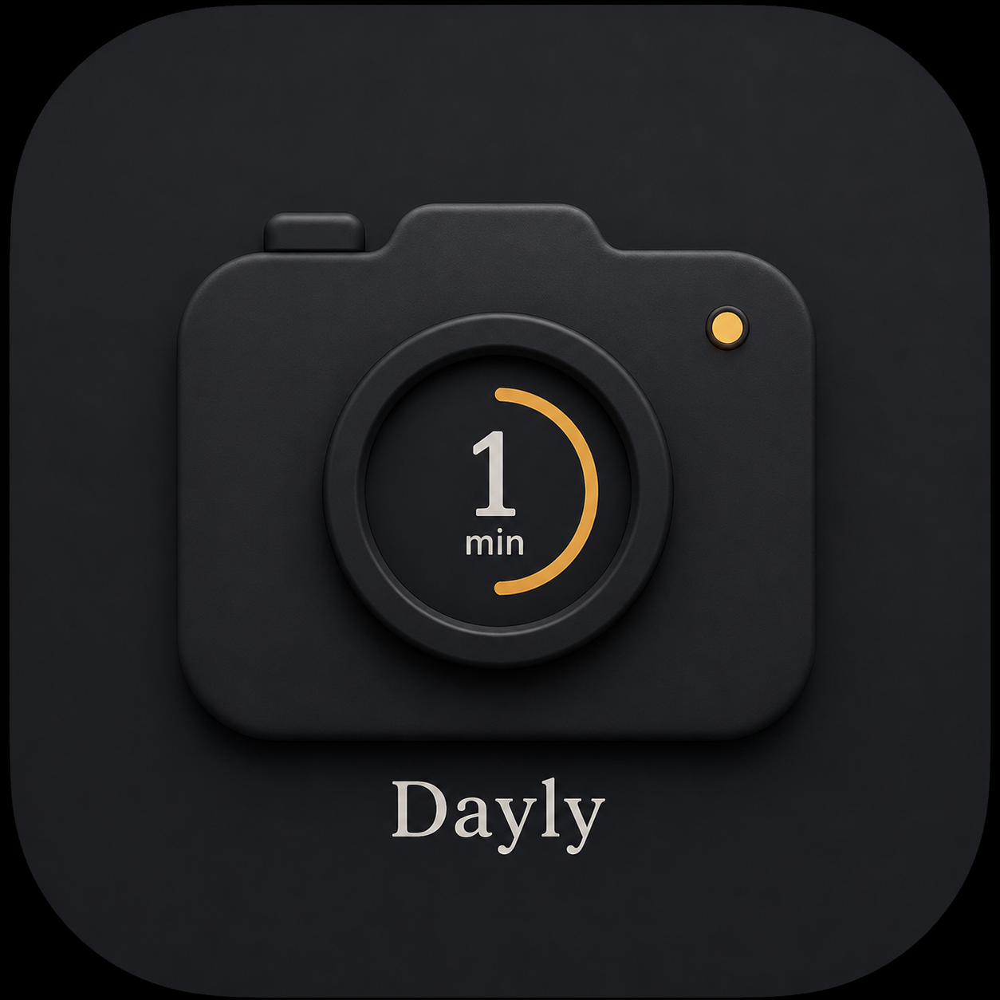

# Dayly

<p align="center">
  
</p>

<p align="center">
  <strong>Your life, one second at a time.</strong><br />
  A private, cinematic Flutter diary for recording tiny daily video memories and turning them into a living film.
</p>

<p align="center">
  <a href="https://flutter.dev"></a>
  <a href="https://dart.dev"></a>
  
  
</p>

---

## What Is Dayly?

Dayly is a one-second personal video diary built around a simple idea: record a small honest moment every day, then watch those moments become a film of your life.

It is intentionally private, local-first, and quiet. No feeds. No likes. No cloud account. Just your clips, your calendar, your notes, and a warm film-inspired interface.

## Highlights

- Record short daily clips with a cinematic camera flow.
- Browse memories through a calendar-first diary.
- Tap a day to see whether it was recorded, then replay that day's clips and notes.
- Compile recorded moments into an exportable diary film.
- Burn Super-8 style date stamps into compiled videos.
- Save compiled films to the device gallery.
- Configure daily reminder notifications.
- Personalize the interface with themes, backgrounds, fonts, navigation styles, and UI kits.
- Use the app in English, Spanish, Persian, Turkish, or Arabic.
- Keep data local on-device by default.

## Design Language

Dayly is designed to feel more like a keepsake than a utility app:

- Dark cinematic base palette with warm amber accents.
- Film-frame video treatment with timestamp borders.
- Soft onboarding and splash motion.
- Calendar-driven memory browsing.
- Multiple visual skins, from clean Material to glass, neumorphic, retro, and neubrutalist styles.

For deeper product and UX notes, read [`Design.MD`](Design.MD).

## Tech Stack

Dayly is built with Flutter and Dart, using a modular architecture that keeps feature screens independent from the active component library.

Core app:

- `flutter` and `dart` for the application runtime.
- `flutter_riverpod` for state management.
- `go_router` for declarative navigation.
- `shared_preferences` for persisted user settings.
- Flutter `gen-l10n` ARB localization.

Media pipeline:

- `camera` for capture.
- `video_player` and `chewie` for playback.
- `ffmpeg_kit_flutter_new` for compiling clips and rendering timestamps.
- `saver_gallery` for exporting generated videos.

Storage and device integrations:

- `isar_community` for local clip metadata.
- `path_provider` for app-private file paths.
- `permission_handler` for camera, microphone, storage, and notification permission flows.
- `flutter_local_notifications`, `timezone`, and `flutter_timezone` for daily reminders.

Interface system:

- `shadcn_flutter` as the default UI kit.
- `liquid_glass_renderer` for glass surfaces.
- `flutter_neumorphic_plus` for neumorphic controls.
- `nes_ui`, `chicago`, and `neubrutalism_ui` for experimental visual kits.
- `crystal_navigation_bar` and `curved_navigation_bar` for bottom navigation styles.
- `google_fonts` for selectable typography presets.

## Architecture

Feature code does not import a specific UI package directly. Screens render through semantic widgets and a shared `UiKit` contract, which lets the app switch visual systems without rewriting product screens.

```text
lib/
├── app/          app root, router, tab shell, navigation bars
├── core/         platform helpers, services, media/export utilities
├── data/         Isar entities, repositories, day notes
├── features/     today, diary, recording, compile, player, onboarding, settings
├── l10n/         ARB files and generated localizations
├── models/       domain models
├── state/        Riverpod controllers and persisted settings
├── theme/        palette, design tokens, typography, icons, backgrounds
└── ui/           UI-kit abstraction, semantic widgets, visual kits, motion
```

## Getting Started

### Prerequisites

- Flutter SDK with Dart 3.10 or newer.
- Android SDK and an Android device/emulator.
- Java 17 for Android builds.

### Install

```bash
git clone https://github.com/DanixMP/Dayly.git
cd Dayly
flutter pub get
flutter gen-l10n
```

### Run

```bash
flutter run -d android
```

### Build Android APK

```bash
flutter build apk --release
```

The release APK is generated at:

```text
build/app/outputs/flutter-apk/app-release.apk
```

## Privacy

Dayly is local-first. Recordings, thumbnails, notes, compiled videos, custom backgrounds, and preferences are stored on the user's device unless the user explicitly exports or shares them.

The app does not require an account and does not include a social feed, advertising network, or remote sync backend.

## Roadmap Ideas

- Richer memory search and filtering.
- More export templates and film styles.
- Optional encrypted backup.
- Better tablet and foldable layouts.
- Screenshot gallery for the public README.
- Wider desktop support once native media plugin coverage is stable.

## Contributing

Contributions are welcome. Please read [`CONTRIBUTING.md`](CONTRIBUTING.md) before opening issues or pull requests.

Good first areas:

- Translation improvements.
- Accessibility review.
- UI kit polish.
- Android device testing.
- Documentation and screenshots.

## Issues

- Need a UI tweak for glassmorphism and NesUI and Chicago UI

## License

Dayly is open source under the [MIT License](LICENSE).
Feel Free to Do any changes you want. Just let me know :)
